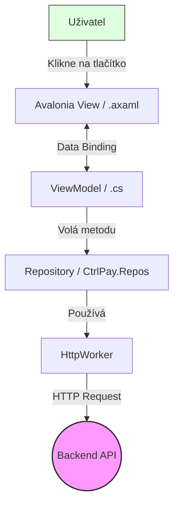
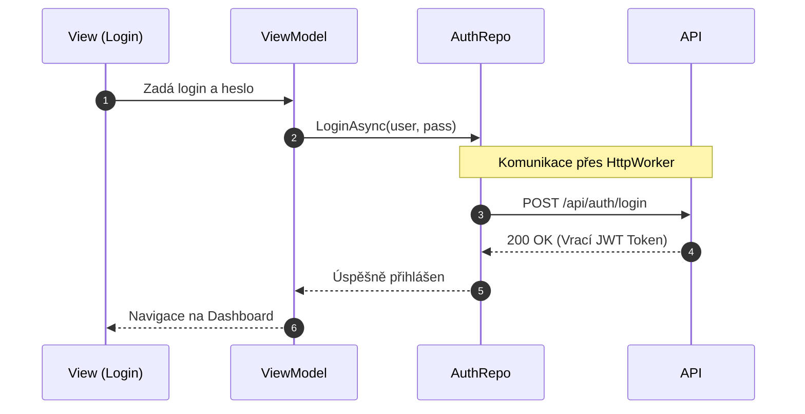
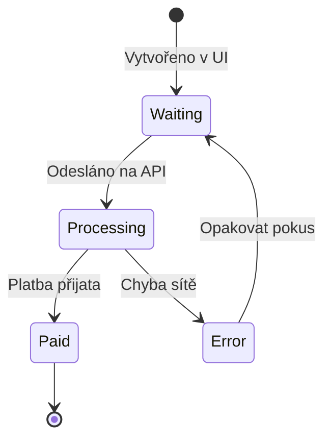
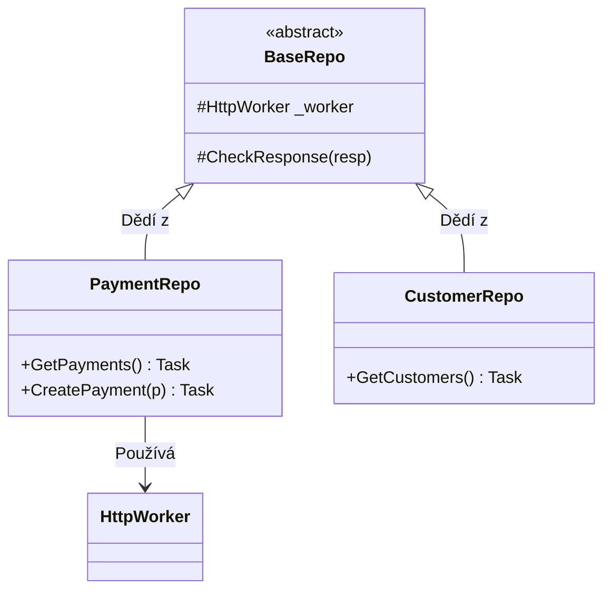

# 📊 Mermaid Diagramy pro CtrlPay (Tahák pro dokumentaci)

Tento soubor obsahuje šablony diagramů, které můžeš použít ve své části dokumentace (Frontend & Repos). V Obsidianu se tyto bloky automaticky vykreslí jako grafy.

---

## 1. Flowchart (Architektura Frontendu)
Tento graf ukazuje, jak tečou data od uživatele přes tvůj kód až do databáze/API.

*   **Tip:** Použij `graph LR` pro zobrazení zleva doprava nebo `graph TD` pro shora dolů.

---

## 2. Sequence Diagram (Průběh přihlášení)
Ideální pro vysvětlení komunikace mezi tvým Repozitářem a API v čase.

*   **Note over:** Vytvoří žlutou poznámku přes vybrané účastníky.
*   **-->>:** Přerušovaná šipka značí návratovou hodnotu (response).

---

## 3. State Diagram (Stavy platby)
Pokud dokumentuješ, jak se mění stavy v UI (např. barva ikonky u platby), použij toto.

---

## 4. Class Diagram (Struktura Repozitářů)
Tímhle ukážeš, jak máš zorganizované třídy v projektu `CtrlPay.Repos`.

*   `BaseRepo <|-- PaymentRepo` znamená, že PaymentRepo dědí z BaseRepo.
*   `+` je public metoda, `#` je protected (přístupná pro potomky).

---

## Jak to použít v dokumentaci?
1. Zkopíruj si vybraný blok (včetně těch tří zpětných apostrofů a slova `mermaid`).
2. Vlož ho do svého hlavního dokumentu.
3. Uprav texty v uvozovkách nebo názvy krabiček podle toho, co zrovna popisuješ.

*Vytvořeno pro projekt CtrlPay.*
